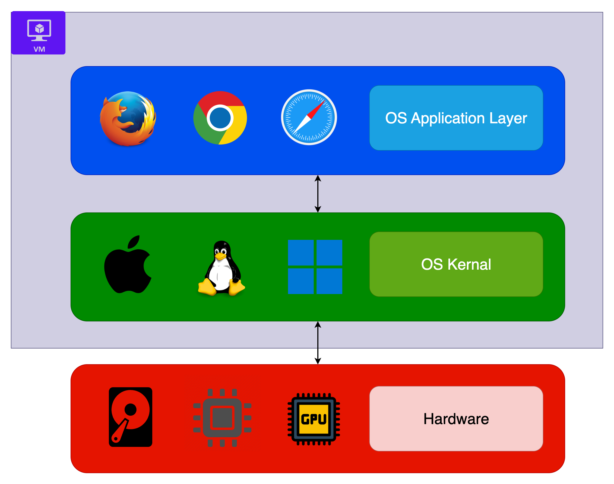

# 🐳 Docker Essentials

## Introduction

Docker is a platform that allows developers to **package applications** and their dependencies into lightweight, portable containers.  

These containers can run on any machine with Docker installed, ensuring consistency between development, testing, and production environments.

## 🤔 Why Docker?

- Solves the “works on my machine” problem by standardising environments.
- Makes it easy to scale applications using orchestration tools like Kubernetes or Docker Swarm.
- Lightweight compared to Virtual Machines (VMs) since containers share the host OS kernel.
  
### ⚖️ Virtual Machines vs Containers

To understand containers vs virtual machines, it helps to first look at how an operating system is structured:

- **Applications layer**: Software and services that sit on top of the kernel and interact with users.
- **Kernel**: The core that communicates directly with hardware (CPU, memory, storage). It manages resource allocation to applications.

The main difference between containers and virtual machines is that VMs simulate an entire machine, including the hardware, whereas containers only virtualise the application layer and its dependencies on top of the host operating system.

#### Virtual Machines (VMs):

- Virtualise the entire operating system (kernel + applications layer).
- Each VM brings its own kernel, independent of the host.
- Example: Running a Linux VM on a Windows host requires emulating the Linux kernel completely.

#### Docker (containers):

- Virtualises only the applications layer.
- Uses the host machine’s kernel instead of shipping its own.
- Example: A container may include Python, Node.js, or Java runtimes plus an app, but relies on the host kernel for system calls.

| Aspect            | Virtual Machines (VMs)                                                                 | Containers (Docker)                                                           |
|-------------------|------------------------------------------------------------------------------------------|-------------------------------------------------------------------------------|
| **Architecture**  | Emulates an entire OS (guest OS per VM).                        | Shares the host OS kernel; packages only app + runtime + dependencies.        |
| **OS Overhead**   | Each VM includes a full OS, making it heavy.                                             | No full OS inside; lightweight because containers reuse the host OS kernel.   |
| **Size**   | Heavy – often GBs (full OS images).                                             | Lightweight – usually MBs (only app layer + deps).   |
| **Startup Time**  | Slow – can take **minutes** (booting a full OS).                                         | Fast – starts in **seconds** (just a process).                                |
| **Resource Usage**| High – each VM consumes RAM, CPU, and storage for its OS.                                | Low – multiple containers share system resources efficiently.                 |
| **Isolation**     | Strong isolation – each VM is like a completely separate machine.                        | Process-level isolation – secure, but shares kernel.                          |
| **Portability**   | Limited – VMs are large and harder to move around.                                       | High – containers are portable, consistent across dev/test/prod.              |
| **Density**       | Fewer VMs can run on a single host (due to OS overhead).                                 | Many containers can run on the same host.                                     |

## 👍 Core Concepts

- **Dockerfile**: A set of instructions for building a Docker image.
- **Image**: A blueprint/template for creating containers (immutable snapshot).  
  One image can be used to create **multiple containers** at the same time. Each container runs independently but is based on the same image.
- **Container**: A running instance of an image.
- **Volume**: Persistent storage mechanism for containers.
- **Registry**: Online store for images (e.g., Docker Hub, AWS ECR).
- **Docker Compose**: Tool to manage multi-container applications using a YAML file.

### ⚖️ Registry vs Repository

| Aspect            | Registry                                                                 | Repository                                                                 |
|-------------------|--------------------------------------------------------------------------|----------------------------------------------------------------------------|
| **Definition**    | A **service** that stores and distributes Docker images.                 | A **collection of related Docker images** (usually different tags/versions). |
| **Scope**         | Global – can contain many repositories.                                  | Local to a project/application within the registry.                        |
| **Examples**      | Docker Hub, AWS Elastic Container Registry (ECR), GitHub Container Reg.  | `nginx`, `python`, `my-app` (inside a registry).                           |
| **Naming**        | Registry domain + repository name (and optionally tag).                  | The repository part of the image name (without domain).                    |
| **Analogy**       | 📦 **Library** (stores many books).                                      | 📖 **A single book series** with different editions (tags).                 |
| **Usage Example** | `docker pull registry.hub.docker.com/library/nginx:latest`               | `nginx:latest`, `nginx:1.25`, `nginx:alpine`                              |

## 🚀 Structure of a Dockerfile

| Instruction | Purpose                                                                 | Example                                      |
|-------------|-------------------------------------------------------------------------|----------------------------------------------|
| **FROM**    | Sets the parent/base image for your build. It’s the starting point for your image. | `FROM ubuntu:20.04`                          |
| **RUN**     | Executes commands at build time inside the container environment. Used to install software or set up the environment. | `RUN apt-get update && apt-get install -y python3` |
| **COPY**    | Copies files or directories from the host machine into the image. Can copy multiple files or directories. | `COPY . /app` → copy everything from current dir to `/app`    `COPY requirements.txt /app/` → copy a single file to `/app`   `COPY src/ /app/src/` → copy a whole directory to `/app/src/` |                             |
| **WORKDIR** | Sets the working directory inside the container. Equivalent to running `cd` in a shell. | `WORKDIR /app`                               |
| **CMD**     | Specifies the default command that runs when the container starts. Only one CMD is effective (the last one if multiple are present). | `CMD ["python3", "app.py"]`                  |

## 🚀 Best Practices

- Keep Dockerfiles small and efficient by leveraging caching (install dependencies before copying code).
- Use `.dockerignore` to exclude unnecessary files (e.g., `node_modules`, `.git`).
- Run **one process per container** (e.g., Node app in one, database in another).
- Tag images with meaningful versions (e.g., `myapp:1.0.0` instead of `latest`).
- Use **volumes** for data persistence (databases, configs).
- Leverage **Docker Compose** for multi-service apps.
